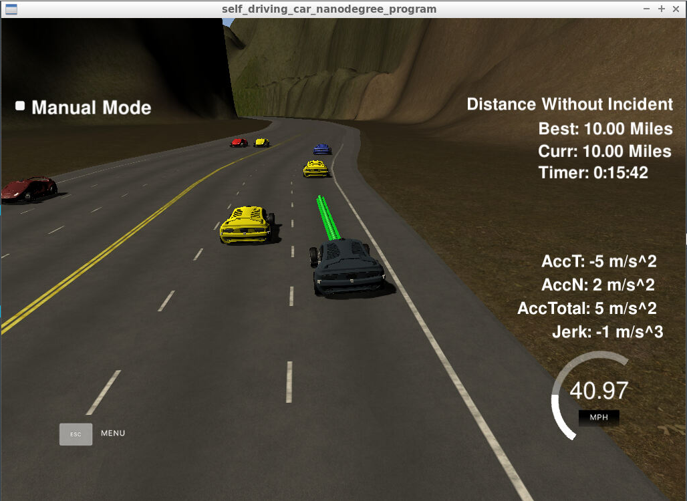
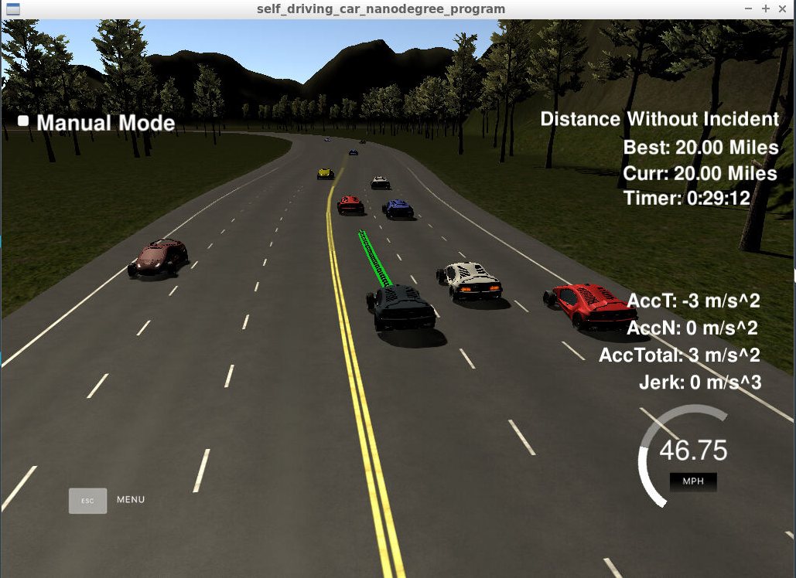
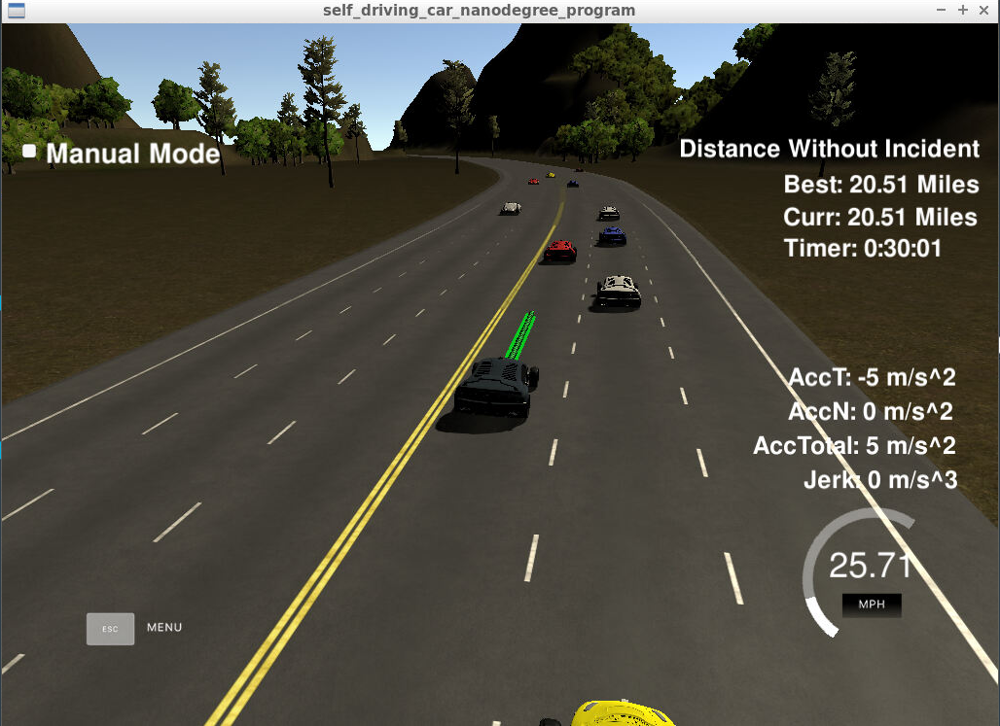

# CarND-Path-Planning-Project
Self-Driving Car Engineer Nanodegree Program

[](http://www.udacity.com/drive)


## Overview
In this project the goal is to safely navigate around a virtual highway with other traffic that is driving +-10 MPH of the 50 MPH speed limit on a simulator provided by Udacity (You can download the Simulator [here](https://github.com/udacity/self-driving-car-sim/releases/tag/T3_v1.2)). The simulator sends car telemetry information like car's localization and sensor fusion data, plus sparse map list of waypoints around the highway. I was able to rwrite a code that make the car go as close as possible to the 50 MPH speed limit, which means passing slower traffic when possible, note that other cars trying to change lanes too. The car avoid hitting other cars at all cost as well as driving inside of the marked road lanes at all times, unless going from one lane to another. The car able to make one complete loop around the 6946m highway. Since the car is trying to go 50 MPH, it takes a little over 5 minutes to complete 1 loop. Also the car not experience total acceleration over 10 m/s^2 and jerk that is greater than 10 m/s^3. Udacity provides a seed project to start from on this project ([here](https://github.com/udacity/CarND-Path-Planning-Project)).

#### The map of the highway is in data/highway_map.txt
Each waypoint in the list contains  [x,y,s,dx,dy] values. x and y are the waypoint's map coordinate position, the s value is the distance along the road to get to that waypoint in meters, the dx and dy values define the unit normal vector pointing outward of the highway loop.

The highway's waypoints loop around so the frenet s value, distance along the road, goes from 0 to 6945.554.

## Important Dependencies

The minimum project dependency versions are:

* cmake >= 3.5
  * All OSes: [click here for installation instructions](https://cmake.org/install/)
* make >= 4.1 (Linux, Mac), 3.81 (Windows)
  * Linux: make is installed by default on most Linux distros
  * Mac: [install Xcode command line tools to get make](https://developer.apple.com/xcode/features/)
  * Windows: [Click here for installation instructions](http://gnuwin32.sourceforge.net/packages/make.htm)
* gcc/g++ >= 5.4
  * Linux: gcc / g++ is installed by default on most Linux distros
  * Mac: same deal as make - [install Xcode command line tools](https://developer.apple.com/xcode/features/)
  * Windows: recommend using [MinGW](http://www.mingw.org/)
* Udacity's Term 3 [simulator](https://github.com/udacity/self-driving-car-sim/releases/tag/T3_v1.2)


#### uWebSocketIO Starter Guide
The communication between the simulator and the path planner is done using [WebSocket](https://en.wikipedia.org/wiki/WebSocket). The path planner uses the [uWebSockets](https://github.com/uNetworking/uWebSockets) WebSocket implementation to handle this communication. The package does this by setting up a web socket server connection from the C++ program to the simulator, which acts as the host. [uWebSocketIO](https://github.com/uWebSockets/uWebSockets) for either Linux or Mac systems. For windows you can use either Docker, VMware, or even [Windows 10 Bash on Ubuntu](https://www.howtogeek.com/249966/how-to-install-and-use-the-linux-bash-shell-on-windows-10/) to install uWebSocketIO.
* If you install from source, checkout to commit `e94b6e1`, i.e.
    ```
    git clone https://github.com/uWebSockets/uWebSockets 
    cd uWebSockets
    git checkout e94b6e1

The particular project implementation was done on **Linux OS** and the rest of this documentation will be focused on Linux OS. The project also support Mac operating system.

In order to install the necessary libraries, from the project repository directory run the script either [install-ubuntu.sh](https://github.com/aliasaswad/CarND-Path-Planning-Project-P7/blob/master/install-ubuntu.sh) for Linux user or  [install-mac.sh](https://github.com/aliasaswad/CarND-Path-Planning-Project-P7/blob/master/install-mac.sh) for Mac user.

## Project files structure
The directory structure of this repository is as follows:

```
root
|   CMakeLists.txt
|   LICENSE
|   README.md
|   cmakepatch.xt
|   install-mac.sh
|   install-ubuntu.sh
|   set_git.sh
|
|___data
|   |   
|   |   highway_map.csv
|   
|   
|___src
    |   helpers.h
    |   json.hpp
    |   main.cpp
    |   spline.h
    |   particle_filter.cpp
    |___Eigen
    |   |   
    |   |   ...
    |   |   ...
        .
        .
        .
    

```
The Path Planning algorithms is implemented in [`src/main.cpp`](https://github.com/aliasaswad/CarND-Path-Planning-Project-P7/blob/master/src/main.cpp). Inside `data/[highway_map.csv](https://github.com/aliasaswad/CarND-Path-Planning-Project-P7/blob/master/data/highway_map.csv)` there is a list of waypoints that go all the way around the track. The track contains a total of 181 waypoints, with the last waypoint mapping back around to the first. The waypoints are in the middle of the double-yellow dividing line in the center of the highway.

## Running the Code
This repository includes two files that can be used to set up and install uWebSocketIO for either Linux or Mac systems. For windows you can use either Docker, VMware, or even Windows 10 Bash on Ubuntu to install uWebSocketIO. Tips for setting up your environment can be found [here](https://classroom.udacity.com/nanodegrees/nd013/parts/40f38239-66b6-46ec-ae68-03afd8a601c8/modules/0949fca6-b379-42af-a919-ee50aa304e6a/lessons/f758c44c-5e40-4e01-93b5-1a82aa4e044f/concepts/23d376c7-0195-4276-bdf0-e02f1f3c665d)

Once the install for uWebSocketIO is complete, the main program can be built and ran by doing the following from the project top directory.

1. Create a build directory: `mkdir build && cd build`
2. Compile:`cmake ..`
3. `make`, this will create executable
    -  `path_planning`, which is our implementation
4. Finally, run `./path_planning`


Alternatively some scripts have been included to streamline this process, these can be leveraged by executing the following in the top directory of the project:
```
$ ./clean.sh
$ ./build.sh
$ ./run.sh
```
To run the particle filter we need to run both `./run.sh` using the terminal and the simulator. The output should be like:

`Listening to port 4567
`

Which means that the implemtation code now connected to the simulator right away.
Run the simulator shoud show the below image:


Click the "Select" button to begin check your code behavior and how the car drive on the highway autonomously! as shown in the image below:



## Details

1. The car uses a perfect controller and will visit every (x,y) point it recieves in the list every .02 seconds. The units for the (x,y) points are in meters and the spacing of the points determines the speed of the car. The vector going from a point to the next point in the list dictates the angle of the car. Acceleration both in the tangential and normal directions is measured along with the jerk, the rate of change of total Acceleration. The (x,y) point paths that the planner recieves not have a total acceleration that goes over 10 m/s^2, also the jerk not go over 50 m/s^3.

2. There be some latency between the simulator running and the path planner returning a path maybe just 1-3 time steps. During this delay the simulator will continue using points that it was last given, because of this I store the last points I have used so I can have a smooth transition which are previous_path_x, and previous_path_y. Also, I create a new path that has a smooth transition with this last path.

### Tips

A really helpful resource for doing this project and creating smooth trajectories was using http://kluge.in-chemnitz.de/opensource/spline/, the spline function is in a single hearder file is really easy to use. It was a great suggestion from the project classroom QA video to use splines instead of polynomials.

## Valid trajectories
#### The car is able to drive 20 miles without incident as shown below:



And more than 30 minutes:

 

I want to mention that for:

#### 1- Speed
The car drives according to the speed limit, and no speed limit red message was seen.
 
#### 2- Jerk
Max Acceleration and Jerk are not exceeded, and no max jerk red message was seen.

#### 3- Collision
The car does not have collisions and no collisions message was seen.

#### 4- Stay in lane
The car able to stay in its lane most of the time except for the time between changing lanes because of traffic or to return to the center lane.

#### 5- Change lanes
The car change lanes when the there is a slow traffic in front of it, and it is safe to change lanes (use sensor_fusion data to check there are no other cars around) or when it is safe to return the center lane.


## Code Reflection
The path planning algorithm implemented in [src/main.cpp](https://github.com/aliasaswad/CarND-Path-Planning-Project-P7/blob/master/src/main.cpp) from the provided code by Udacity for this seed [project](https://github.com/udacity/CarND-Path-Planning-Project). The code contain three major parts calculations:

### 1. Prediction
The file `main.ccp` contain the prediction calculations, specificlly from line_code [111 to 147](https://github.com/aliasaswad/CarND-Path-Planning-Project-P7/blob/master/src/main.cpp#L111-#L147). This part of the code deal with the telemetry and sensor fusion data. The sensor_fusion variable contains all the information about the cars on the right-hand side of the road. It's important that the car doesn't crash into any of the other vehicles on the road, all of which are moving at different speeds around the speed limit and can change lanes. A car is considered "dangerous" when its distance to our car is less than 30 meters in front or behind us.  

### 2. Behavior
In this part the car will make a decission to either change lane if there is a car in front of it or speed up/slow down depending on the situation. This implementtation could be found in the `main.cpp` file, line_code [149 to 172](https://github.com/aliasaswad/CarND-Path-Planning-Project-P7/blob/master/src/main.cpp#L149-#L172). This part depend on the above one (**Prediction**) to decide whether the car needs to increase the speed, decrease it, or make a lane change when it is safe. The code depend on `speed_diff` to change the car speed makes the car response more faster to the around it.

### 3. Trajectory
This part from the code used to calculate the trajectory depending on the speed and lane output from the behavior part above. This implementtation could be found in the `main.cpp` file, line_code [174 to 274](https://github.com/aliasaswad/CarND-Path-Planning-Project-P7/blob/master/src/main.cpp#L174-#L274). Spline calculation was used to make this work less complicated. Also, the coordinates are transformed (shift and rotation) to local car coordinates. In order to ensure more continuity on the trajectory (in addition to adding the last two point of the pass trajectory to the spline adjustment), the pass trajectory points are copied to the new trajectory. The rest of the points are calculated by evaluating the spline and transforming the output coordinates to not local coordinates. The important thing is the change in the velocity of the car from line_code [250 to 256](https://github.com/aliasaswad/CarND-Path-Planning-Project-P7/blob/master/src/main.cpp#L174-#L250-#L256). The speed change is decided on the **behavior** part of the code, but it is used in that part to increase/decrease he tspeed on every trajectory points instead of doing it for the complete trajectory.

## How to write a README
A well written README file can enhance your project and portfolio.  Develop your abilities to create professional README files by completing [this free course](https://www.udacity.com/course/writing-readmes--ud777).

